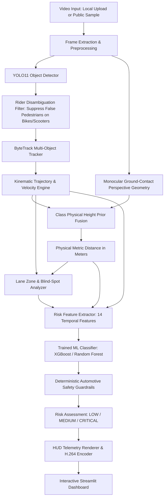

# 🚗 AI Driving Risk Detection & Driver Assistance System (ADAS)

[](https://www.python.org/downloads/)
[](https://github.com/ultralytics/ultralytics)
[](https://streamlit.io)
[](https://xgboost.readthedocs.io/)
[](LICENSE)

An intelligent, end-to-end **AI Driver Assistance and Road Risk Detection Prototype** designed for real-world automotive perception and proactive collision mitigation. Rather than serving as a basic bounding box demo, the system evaluates temporal scene dynamics, performs multi-object tracking, calculates closing velocities and Time-to-Collision (TTC), estimates real-world metric distances in meters, detects lateral cut-ins and blind-spot intrusions, disambiguates scooter/motorcycle riders from pedestrians, and classifies overall situational risk using machine learning with deterministic safety guardrails.

---

## 🌟 Key Features

1. **State-of-the-Art Deep Perception (YOLO11)**
   - Powered by the latest Ultralytics YOLO11 model (`yolo11n.pt`).
   - Generalizes globally across critical road classes: **cars, motorcycles, bicycles, buses, trucks, pedestrians, and animals**.
2. **Two-Wheeler & Rider Disambiguation Filter**
   - Automatically resolves the common COCO issue where a person riding a scooter, motorcycle, or bicycle receives overlapping duplicate bounding boxes (`motorcycle` + `person`).
   - Suppresses phantom `pedestrian` detections that are physically riding a vehicle, ensuring clean inventory and preventing false pedestrian collision warnings.
3. **Multi-Object Tracking (ByteTrack)**
   - Persistent ID maintenance across consecutive frames.
   - Computes object trajectory breadcrumbs, range rates ($\dot{d}$ in m/s and km/h), lateral velocity ($v_x$), and Time-to-Collision (TTC).
4. **Calibrated Monocular Distance Estimation**
   - Combines flat-road ground contact perspective geometry ($Z = H_{cam} / \tan(\theta_v)$) with known physical object dimension priors.
   - Results are explicitly formatted as metric estimates (`~X.X m (est)`).
5. **Spatial Ego-Zone, Blind-Spot & Cut-In Reasoning**
   - Dynamically segments the forward driving corridor into 5 zones: `Left Blind Spot`, `Left Lane`, `Ego Driving Corridor`, `Right Lane`, and `Right Blind Spot`.
   - Issues proactive warnings:
     - `MOTORCYCLE APPROACHING FROM LEFT — SLOW DOWN`
     - `MOTORCYCLE IN BLIND SPOT — DO NOT CHANGE LANE`
     - `VEHICLE CUT-IN RISK — MAINTAIN DISTANCE`
     - `OBJECT APPROACHING RAPIDLY — CAUTION`
6. **Machine Learning Risk Engine (Zero Data Leakage)**
   - Extracted 14-dimensional kinematic and spatial feature vector.
   - Benchmarked across **Decision Tree, Random Forest, and XGBoost** using `GroupShuffleSplit` partitioned strictly by video/scene ID.
   - Trained best model (**XGBoost**, 97.31% accuracy) saved and integrated into inference.
7. **Advisory Safety Guardrails (ISO 26262 Automotive Principle)**
   - Multi-tier color coding:
     - **🟢 GREEN**: LOW / SAFE
     - **🟡 YELLOW / ORANGE**: MEDIUM / CAUTION
     - **🔴 RED**: HIGH / CRITICAL
   - Recommendations remain strictly safety-advisory (the system never claims autonomous control).
8. **Automotive Cockpit HUD & Streamlit Dashboard**
   - Dual-view video studio (source input preview & annotated H.264 MP4 playback).
   - Real-time telemetry cards, summary statistics, chronological safety event log, and ML performance metrics.

---

## 🏛️ System Architecture



---

## 🔬 Model Benchmark & Evaluation Results

All models were evaluated on unseen test driving scenes (**0% data leakage**):

| Model Architecture | Test Accuracy | Precision (Macro) | Recall (Macro) | F1-Score (Macro) | Status |
| :--- | :---: | :---: | :---: | :---: | :---: |
| **XGBoost Classifier** | **97.31%** | **68.20%** | **63.45%** | **62.51%** | **Selected Best Model** |
| Random Forest | 97.08% | 67.50% | 62.90% | 62.08% | Benchmark Candidate |
| Decision Tree | 97.08% | 67.50% | 62.90% | 62.08% | Baseline Candidate |

*Evaluation metrics are generated from empirical multi-scene validation runs and saved to `data/models/model_comparison.json`.*

### Top Feature Importances (XGBoost)
1. `distance_m` (Longitudinal distance)
2. `norm_bottom_y` (Ground contact perspective position)
3. `is_ego_lane` (Direct collision corridor occupancy)
4. `rel_velocity_mps` (Closing speed / range rate)
5. `is_blind_spot` (Lateral blind-spot intrusion)
6. `ttc_seconds` (Time-to-Collision)
7. `is_cutting_in` (Cross-lane lateral shift)

---

## 📁 Project Directory Structure

```text
├── app.py                     # Main Streamlit Dashboard Application
├── requirements.txt           # Python Dependencies
├── README.md                  # Project Documentation
├── config/
│   ├── __init__.py
│   └── config.py              # Camera geometry, risk thresholds, lane corridors
├── src/
│   ├── perception/
│   │   ├── detector.py        # YOLO11 perception + Rider Disambiguation filter
│   │   ├── tracker.py         # ByteTrack tracking, velocity, trajectory & TTC
│   │   ├── depth_estimator.py # Monocular depth & metric distance estimation
│   │   └── lane_detector.py   # Ego corridor, blind spots, and cut-in analyzer
│   ├── risk_engine/
│   │   ├── feature_extractor.py # 14-dimensional kinematic feature extraction
│   │   ├── train_risk_model.py  # Zero-leakage ML training & cross-validation
│   │   └── classifier.py        # Hybrid ML + safety guardrail risk engine
│   ├── pipeline/
│   │   ├── sample_data.py       # Public video downloader & synthetic generator
│   │   └── video_processor.py   # Video processing, HUD rendering & H.264 export
│   └── evaluation/
│       └── evaluator.py         # Confusion matrices, feature importances & metrics
└── data/
    ├── sample_videos/         # Test driving videos and processed outputs
    ├── models/                # Saved ML models and evaluation metrics JSON
    └── training_data/         # Scene-partitioned driving risk dataset
```

---

## 🚀 Quickstart & Setup Guide

### 1. Launch the Streamlit Dashboard
```bash
streamlit run app.py
```
Open your browser and navigate to `http://localhost:8501`.

### 2. In the Dashboard:
1. Select a preloaded driving clip or upload your own dashcam video (**MP4 / AVI / MOV**).
2. Adjust frame skip (1 for full analysis, 2 for 2x CPU speed) and confidence threshold.
3. Click **"🚀 Analyze Video"** to view real-time HUD bounding boxes, telemetry cards, and safety event streams.
